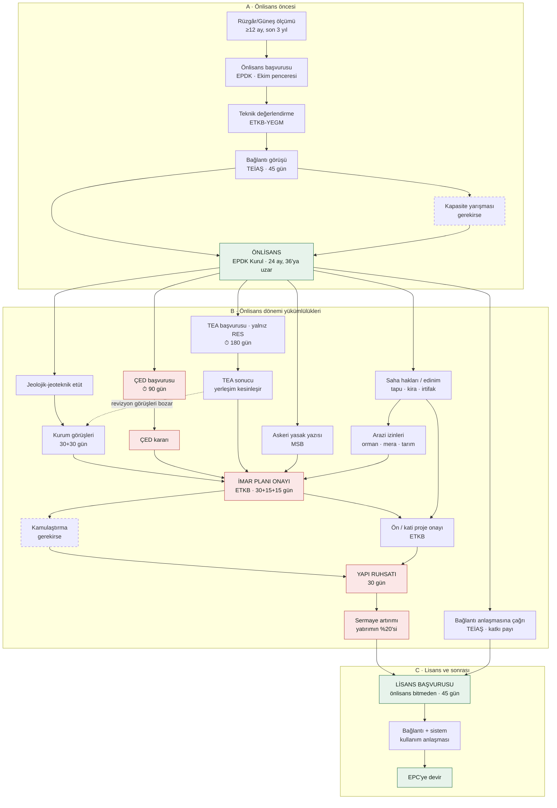

# Naci Notu — ÜRÜN 1

**Kimden:** Ürün sahibi (Claude ile) · **Kime:** Naci ve Naci'nin AI'ı · **Son güncelleme:** 08.10.2026
**Durum: ✅ HEMEN BAŞLANABİLİR.** Bu nottaki her iş için ürün sahibinden ayrıca onay beklenmez.

> **Naci'ye yalnızca iki not var:** bu not (Ürün 1) ve [`NACI_NOTU_URUN2.md`](NACI_NOTU_URUN2.md) (Ürün 2 ve sonrası — ⛔ onay gelmeden başlanmaz). Önceki ayrı notlar (`URUN1_TANSU_NOTLAR.md`, `NACI_NOTU_2026-10-06.md`, `NACI_NOTU_2026-10-08.md`, `BALBAL_ARAYUZ.md`) bu iki nota taşındı; içerik kaybı yok.
> **Referans belgeler (not değil, aynen geçerli):** `BACKEND_GAPS.md`, `BAGLANTI_YOL_HARITASI.md`, `URUN1_ARAYUZ.md`, Anayasa (`anayasa/`).
> **Belge önceliği:** Anayasa (v2.0) > Süreç haritası > `BACKEND_GAPS.md` > bu not. Bu not `BACKEND_GAPS.md` §9'u (B-18) ayrıntılandırır; onunla çelişen yerde bu not daha yenidir, çelişkiyi görürsen yaz.
> **Dil:** Notlar mantığı anlatır; kurulum geliştiriciye aittir. Belirsizlikte sor (P-10), tahminle kod yazma.

## İçindekiler

| Bölüm | Konu | Öncelik |
|---|---|---|
| A | Kararlar ve iş sırası | Önce okunur |
| B | **Balbal fazla tutuk** — anlama, eş anlamlı genişletme, netleştirici soru | **Çok önemli** |
| C | Web testi notları (06–07.10): hesaplar ve ekip sohbeti, Balbal davranışı, belge yükleme, **etiketler (ACİL)**, önlisans belge seti | C.4 acil, sonra C.2, C.3; C.1 ön koşul |
| D | Demo veri kütüphanesi (B-18): kurgu şirket grubu, SPV klasörleri, belge içerik rehberi, kasıtlı tuzaklar, test planı | Şimdi başlar, frontend'le birlikte biter |
| E | 08.10 demo veri eklemeleri | D ile birlikte |
| F | Anayasa uyarıları, beklenen çıktılar, açık sorular | — |

Atıflar: `§C.4` = bu notun C bölümünün 4. maddesi. Başka belgeye atıf dosya adıyla yazılır.

---

## A. Kararlar ve iş sırası (ürün sahibi, 06–08.10.2026)

1. **Ürün 1 hemen yapılır.** Bu nottaki bütün işler (Balbal davranışı, etiketler, belge yükleme, hesaplar, ekip sohbeti, demo veri, test) şimdi başlar.
2. **Ürün 2 ve sonrası onay bekler.** Canvas'taki Balbal tam arayüzü (Mali İşler, İdari İşler, Akış Zincirleri, İK Şirket Yapısı vb.) ve ona bağlı backend işleri [`NACI_NOTU_URUN2.md`](NACI_NOTU_URUN2.md)'dedir; ürün sahibinden **Kayıtlı Kanalda (PR/issue) yazılı onay** gelmeden başlanmaz.
3. **Demo veri kütüphanesi (B-18) paralel yürür ve frontend'le aynı anda biter;** biz frontend'i bitirdiğimizde kütüphane hazır olmalı ve hemen teste geçilmeli. Kütüphane Ürün 2 senaryolarının belgelerini de içerir (ödeme, kredi, masraf) — belge üretmek Ürün 2'ye başlamak sayılmaz.
4. **Kurgu şirketler canvas'taki şirketlerdir.** "Ankara RES / İzmir RES" aşaması geçildi (`BACKEND_GAPS.md` §9.2'deki 28.09 kararı kalktı). Holding ve SPV listesi §D.1'de.
5. **Her departmanda her SPV için ayrı klasör.** Bir SPV'nin bütün bilgisi o SPV'nin klasöründe durur. Belge yüklenince Balbal önce **hangi SPV'ye ait olduğunu** bulur ve o SPV klasörüne yerleştirir; SPV'si belirsizse sorar (B-28 akışı). Holding'e ait belgeler "XYZ Enerji (Holding)" klasörüne, birden çok SPV'yi ilgilendirenler "Ortak" klasörüne. Ayrıntı §D.2.
6. **Öncelik:** Bölüm B (tutukluk) ve §C.4 (etiketler) en önce; sonra §C.2 ve §C.3; §C.1 testlerin anlamlı olması için ön koşul.
7. **Belgeden öğrenme ilkesi (TEMEL İLKE, ayrıntısı Ürün 2 notu §D.1):** Balbal iş parametrelerini (faiz, marj, taksit planı, teminat, süreler, imza yetkileri…) ortak alandaki belgelerden çıkarır; parametre koda/ekrana sabit yazılmaz. Ürün 1 açısından sonucu: **demo belgeler bu değerleri gerçekten içermeli** ki Balbal onları belgeden bulup gösterebilsin. Belgeden bilgi çıkarma ve bağlantı kurma Ürün 1 (Tanıma) altyapısıdır.

---

## B. ÇOK ÖNEMLİ — Balbal fazla tutuk (ürün sahibi, 07.10.2026)
**Gözlem (web testi, Ürün 1, Proje Finans kullanıcısı):** Soru: *"Ankara'nın finansal modeli var mı?"* Ortak alanda ilgili dosya **var**. Balbal'ın cevabı: *"Mevcut şirket kaynaklarında bu soruyu güvenilir şekilde cevaplamak için yeterli bilgi bulamadım — Yeterli veri bulunmamaktadır … belge yükleyebilirsiniz."*

**Teşhis:** Balbal soruyu **anlamaya** çalışmıyor; kullanıcının kelimelerini ("finansal model") ortak alandaki belge adı/türüyle **motamot eşleştirmeye** çalışıyor, eşleşmeyince "yeterli veri yok" diyor. Garanticilik eşiği aşırı sıkı. Bu haliyle Ürün 1'in temel vaadi ("bulur, yönlendirir") çalışmıyor; elinde veri olsa bile soruların çoğunu cevaplayamıyor. **Bu, Ürün 1 ürün testinin en büyük bulgusudur; yetki ve uydurmama kuralları kadar önceliklidir.**

**Beklenen davranış (Anayasa Ç-7.1 ve Ek-F zaten bunu söylüyor; prompt ve retrieval buna göre düzeltilsin):**
1. **Önce anlama.** "Finansal model" bir belge adı değil, bir **kavramdır**: nakit akış tablosu, ödeme planı, DSCR hesabı, fizibilite, bütçe — bunların hepsi finansal modelin parçası ya da eş anlamlısıdır. Retrieval **eş anlamlı / kavramsal genişletme** yapmalı (belge türü sözlüğü: "finansal model" → {nakit akış, ödeme planı, DSCR, fizibilite, bütçe, projeksiyon}; "sözleşme" → {kredi sözleşmesi, tadil, EPC, bakım…}; "lisans" → {önlisans, üretim lisansı, EPDK kararı}). Sözlük parametre tablosunda tutulur (P-8), Ürün sahibi genişletir.
2. **Bulduğunu söyle.** İlgili belge bulunduysa cevap **"Veri yok" değil**, "Ortak alanda Ankara RES için şunlar var: … (linkli). Finansal model derken nakit akış tablosunu mu kastettiniz?" olmalıdır. Belgeyi göstermek Tanıma'dır, yorum değildir — Ürün 1'de serbesttir.
3. **Bulamadıysa bile soru sor.** "Ortak alanda 'finansal model' adıyla bir belge göremiyorum; yanlış anlamış olabilirim — nakit akışı ya da ödeme planını mı kastettiniz? Elimde Ankara RES için şunlar var: …" Cevap **her zaman** bir soru ya da seçenekle biter (Ç-7.1/4). "Belge yükleyebilirsiniz" cümlesi, ancak gerçekten hiçbir ilgili belge yoksa ve o da teklifin **sonunda** gelir; ilk cevap olmaz.
4. **"Yeterli veri bulunmamaktadır" etiketi**, ilgili belge **bulunup okunduğu hâlde** sorunun cevabı belgede yoksa kullanılır. Belge bulunamadıysa "Veri yok"; belge bulundu ama eşleşmeden emin değilse **netleştirici soru** — etiket değil. Bugünkü cevap etiketi yanlış kullanıyor ("ilgili belgeler bulundu ancak yetmedi" diyor, sonra belgeleri göstermiyor).
5. **Eminlik eşiği:** cevap üretme eşiği düşürülsün; düşük eminlikte **cevap vermemek yerine "şunu buldum, bunu mu kastettin" demek** varsayılan davranış olsun. Uydurma yasağı (Ç-6) aynen kalır: Balbal belgede olmayanı söylemez; ama **belgeyi göstermek ve soru sormak uydurma değildir.**
6. **Ekran:** arayüzdeki örnek soru linkleri ("Ankara RES'in güncel minimum DSCR covenant'ı nedir?" vb.) kaldırılsın — hiçbir Balbal arayüzünde öneri çipi/örnek soru olmaz (05.10 kararı). "Yalnızca Proje Finans belgelerinde arar" gibi açıklama metinleri de ekranda durmaz.

**Kabul testi (Ürün 1, §D.6.2'ye eklendi):** "X'in finansal modeli var mı?" sorusuna, ortak alanda nakit akış / ödeme planı / DSCR dosyası varken Balbal **belgeleri linkli listeler ve netleştirici soru sorar**; "yeterli veri yok" cevabı **başarısız** sayılır. Aynı test "sözleşme var mı", "sigorta ne zaman bitiyor", "lisans durumu ne" gibi 10 doğal dil sorusuyla tekrarlanır; en az 9/10 geçmeli.

---

## C. Web testi notları (ürün sahibi, 06–07.10.2026)

**Kaynak:** ürün sahibinin web testi (Ürün 1 arayüzü, Balbal soru-cevap ve belge yükleme ekranları). Güncelleme 07.10: §C.1 proje adları kararı, §C.6 önlisans süreci ve önkoşul ağacı.

### C.1 Tüm personel için hesap ve ekip sohbeti

**Beklenen:** Güncel personel listesindeki herkes sisteme giriş yapabilen bir demo kullanıcıdır. Departman adıyla açılmış eski hesapların (`finans`, `hukuk`, `enerji` vb.) yerini alırlar; sistem yöneticisi hesabı listeye dahil değildir.

- Her kişinin pozisyonu, departmanı, alt birimi ve yöneticisi aşağıdaki listeden gelir. Yönetici bilgisi elle girilmez, İK hiyerarşi şemasından türetilir.
- Kullanıcılar sağ alttaki **ekip sohbeti** butonundan birbirleriyle birebir ve grup halinde konuşabilmeli (B-06b). Balbal bu sohbetlere dahil edilemez; Balbal penceresi ile ekip sohbeti ayrıdır.
- Şifreler bu repoya yazılmaz (repo herkese açık). Demo şifreleri ayrı bir kanaldan paylaşılır.
- Kullanıcı adı önerisi: `ad.soyad`, Türkçe karakterler sadeleştirilmiş (ş→s, ç→c, ğ→g, ı→i, ö→o, ü→u). E-posta: `ad.soyad@xyzenerji.example`.
- Stajyer pozisyonu tanımlı ama şu an boş; hesap açılmaz.

**Güncel personel listesi** — 36 kişi, tamamı kurgusal. Kaynak: tasarım kanvasındaki İK şirket yapısı, 05.10.2026.

| Departman / birim | Pozisyon | Ad Soyad | Bağlı olduğu | Kullanıcı adı |
|---|---|---|---|---|
| Yönetim | Genel Müdür | Levent Aksoy | Yönetim Kurulu | levent.aksoy |
| Proje Finans | Proje Finans Müdürü | Kaan Turhan | Genel Müdür | kaan.turhan |
| Proje Finans | Proje Finans Uzmanı | Oğuz Tekin | Proje Finans Müdürü | oguz.tekin |
| Mali İşler | Mali İşler Müdürü | Elif Şahin | Genel Müdür | elif.sahin |
| Mali İşler / Muhasebe | Muhasebe Uzmanı | Selin Arslan | Mali İşler Müdürü | selin.arslan |
| Mali İşler / Finansal Muhasebe | Finansal Muhasebe Uzmanı | Gökhan Erdem | Mali İşler Müdürü | gokhan.erdem |
| Hukuk | Hukuk Müdürü | Ayşe Yılmaz | Genel Müdür | ayse.yilmaz |
| Hukuk | Avukat | Burak Çelik | Hukuk Müdürü | burak.celik |
| İK | İK Uzmanı | Zeynep Koç | Genel Müdür | zeynep.koc |
| İdari İşler | İdari İşler Sorumlusu | Deniz Kaya | Genel Müdür | deniz.kaya |
| Enerji | Enerji Grubu Müdürü | Kerem Aydın | Genel Müdür | kerem.aydin |
| Enerji / Proje Geliştirme | Proje Geliştirme Uzmanı | Cem Aktaş | Enerji Grubu Müdürü | cem.aktas |
| Enerji / O&M | O&M Mühendisi | Onur Yıldız | Enerji Grubu Müdürü | onur.yildiz |
| Enerji / Üretim-Piyasa | Üretim/Piyasa Uzmanı | Pınar Güler | Enerji Grubu Müdürü | pinar.guler |
| Enerji / Saha Operasyon | Saha Operasyon Müdürü | Murat Kılınç | Enerji Grubu Müdürü | murat.kilinc |
| Saha Operasyon / Karatepe RES | Saha Teknisyeni | Emre Yalçın | Saha Operasyon Müdürü | emre.yalcin |
| Saha Operasyon / Karatepe RES | Saha Teknisyeni | Furkan Kurt | Saha Operasyon Müdürü | furkan.kurt |
| Saha Operasyon / Karatepe RES | Saha Teknisyeni | Volkan Özdemir | Saha Operasyon Müdürü | volkan.ozdemir |
| Saha Operasyon / Karatepe RES | Saha Teknisyeni | Serkan Doğan | Saha Operasyon Müdürü | serkan.dogan |
| Saha Operasyon / Boztepe RES | Saha Teknisyeni | Uğur Şimşek | Saha Operasyon Müdürü | ugur.simsek |
| Saha Operasyon / Boztepe RES | Saha Teknisyeni | Barış Ateş | Saha Operasyon Müdürü | baris.ates |
| Saha Operasyon / Boztepe RES | Saha Teknisyeni | Sinan Polat | Saha Operasyon Müdürü | sinan.polat |
| Saha Operasyon / Boztepe RES | Saha Teknisyeni | Tolga Aslan | Saha Operasyon Müdürü | tolga.aslan |
| Saha Operasyon / Yeşilova RES | Saha Teknisyeni | Mert Aydoğan | Saha Operasyon Müdürü | mert.aydogan |
| Saha Operasyon / Yeşilova RES | Saha Teknisyeni | Okan Yavuz | Saha Operasyon Müdürü | okan.yavuz |
| Saha Operasyon / Yeşilova RES | Saha Teknisyeni | Gürkan Taş | Saha Operasyon Müdürü | gurkan.tas |
| Saha Operasyon / Yeşilova RES | Saha Teknisyeni | Erkan Bulut | Saha Operasyon Müdürü | erkan.bulut |
| Saha Operasyon / Güneşalan GES | Saha Teknisyeni | Ece Duman | Saha Operasyon Müdürü | ece.duman |
| Saha Operasyon / Güneşalan GES | Saha Teknisyeni | Yusuf Akın | Saha Operasyon Müdürü | yusuf.akin |
| Saha Operasyon / Güneşalan GES | Saha Teknisyeni | Ramazan Er | Saha Operasyon Müdürü | ramazan.er |
| Saha Operasyon / Güneşalan GES | Saha Teknisyeni | Nihat Çetin | Saha Operasyon Müdürü | nihat.cetin |
| Enerji / EPC | EPC Proje Mühendisi | Hakan Tunç | Enerji Grubu Müdürü | hakan.tunc |
| EPC | İnşaat Mühendisi | Caner Doğru | EPC Proje Mühendisi | caner.dogru |
| EPC | Elektrik Mühendisi | Melis Karaca | EPC Proje Mühendisi | melis.karaca |
| EPC | EPC Teknikeri | Halil Öztürk | EPC Proje Mühendisi | halil.ozturk |
| EPC | EPC Teknikeri | Semih Kaplan | EPC Proje Mühendisi | semih.kaplan |

**Proje adları — karar verildi (ürün sahibi, 07.10.2026):** "Ankara RES / İzmir RES" aşaması geride kaldı. Demo veri, kanvastaki kurgu şirket grubuna göre hazırlanır:
- **Ana şirket:** XYZ Enerji A.Ş.
- **İşletmedeki projeler:** Karatepe RES, Yeşilova RES, Boztepe RES, Güneşalan GES
- **Geliştirmedeki projeler:** Kızılova RES, Akyar GES, Demirci RES

`ANK_RES` / `IZM_RES` gibi eski kodlar katalogdan ve belgelerden kalkar. Her departmanda her SPV'nin ayrı klasörü olur; yüklenen belge kendi SPV klasörüne yerleşir. Frontend bittiğinde veri kütüphanesi de bitmiş olmalı ki doğrudan teste geçilebilsin.

---

### C.2 Balbal bir iş arkadaşı gibi davranmıyor

**Gözlem (06.10.2026 testi, kapsam: yetkili tüm departmanlar · tüm projeler):**

| Soru | Balbal'ın cevabı |
|---|---|
| ankaranın ilk kredi ödemesi ne zaman ne kadar? | Veri yok |
| peki amendment var mı hiç? | Veri yok |
| amendment ne demek biliyor musun? | Veri yok |

Aynı arşivde `AMD01`, `AMD02` ve `ANK_RES` etiketli belgeler var. Yani en azından tadil belgeleri sistemde mevcut, ama Balbal bunları bulamıyor.

**Sorun:** Balbal "veri yok" kalıbıyla konuşmayı kesip atıyor. Yanlış cevap vermesini kesinlikle istemiyoruz. Ama şu haliyle işlevsel bir iş arkadaşı değil. Bu konu 03.10.2026'da da iletilmişti ("emin değilse / bulamadıysa veri yok" kuralı konuşmayı kesmek değildir); hâlâ uygulanmamış.

**Anayasa dayanağı:** Bu davranış zaten Anayasa **Ç-7.1** (ve Ek-D S-10) ile zorunlu. "Veri Yok" bir cevap sonu değil, başlangıcıdır. Sıra şöyledir: anlama kontrolü → durum bildirimi → yetki içindeki ilgili belgeleri gösterme teklifi → iletişimi açık bırakma. Ekrandaki cevaplar bu dört adımın hiçbirini içermiyor; mevcut davranış Ç-7.1'e aykırı.

Beklenen mantık:

- **Terim soruları.** "Amendment ne demek biliyor musun?" bir belge sorusu değil, bir kavram sorusudur ve "veri yok" bu soruya verilecek bir cevap değildir. Ç-7.1'in ilk adımı (anlama kontrolü) burada doğal yoldur: Balbal "amendment'ı tadil / değişiklik sözleşmesi olarak anlıyorum" der ve bu anlamla arşivde arar. Terimi tanımıyorsa "bu terimi tanımıyorum" diyebilir.
- **Açık soru (Proje Yetkilileri):** Belgeden bağımsız genel bir terim tanımı vermek (ör. "amendment, sözleşmenin değiştirilmesidir") Ürün 1'de serbest mi, yoksa Ç-6'daki "kaynakta olmayan bilgi" sınırına mı girer? Karar verilene kadar Balbal terimi anlama kontrolü ve belge araması üzerinden ele alır; kaynaksız tanım cümlesi kurmaz.
- **Terimden belgeye köprü.** Balbal terimin Türkçe karşılığından (amendment → tadil, değişiklik sözleşmesi, ek protokol) yola çıkıp klasörlerde arayabilmeli. Bulduğu belgeleri kaynağıyla göstermeli. Örneğin "Ankara RES kredisine ait iki tadil belgesi buldum: …".
- **Sohbet bağlamı.** "Peki amendment var mı hiç?" bir önceki sorunun devamıdır (Ankara RES kredisi). Balbal konuşmanın bağlamını taşımalı; her mesajı sıfırdan bağımsız bir soru gibi ele almamalı.
- **Netleştirme ve öneri.** Soru belirsizse ya da terim belgelerle eşleşmiyorsa, Balbal olası karşılıkları önerip "bunu mu kastettiniz?" diye sorar. Bulamadığında ne aradığını ve nerede aradığını söyler: "Ankara RES kredi klasöründe ödeme planı bulamadım; geri ödeme planı Excel'i yüklü mü?" gibi.
- **Güvenlik çizgisi aynı kalır.** Belge içeriği hakkında yorum ve tahmin yok, kaynak gösterilir. Hesaplanmış toplam yoksa Balbal hesaplamaz; bulduğu kayıtları "elimde sadece bunlar var" diye listeler. Kavramsal açıklamanın şirket belgesi olmadığı cevapta görünür olmalı.

**Geliştiriciye soru:** "Ankara'nın ilk kredi ödemesi" sorusu bir bulma hatası mı, yoksa arşivde ödeme planı içeren bir belge mi yok? Hangisi olduğu test raporunda ayrıca belirtilsin.

---

### C.3 Belge yüklemede alanları önce kişi dolduruyor

**Gözlem:** Belge yüklenirken sistem alanları önce kişinin doldurmasını istiyor. Etiketlerde "Mevcut: —" görünüyor, yani Balbal hiçbir etiket uygulamamış.

**Bu kesinlikle olmamalı.** Akış şöyledir:

1. Belge atılır, önce Balbal okur.
2. Balbal departmanı, klasörü ve alt klasörü bulur; belge adını, tarihini, karşı tarafı, türü ve etiketleri **kendisi doldurur**.
3. Kişi yalnızca gerekiyorsa düzeltir ve onaylar. Eminlik %80'in altındaki alanlarda "Onaylıyorum" işareti zorunludur ve log tutulur.

Boş form ve "lütfen doldurun" yaklaşımı Ürün 1'in temel iddiasına (veriye hakimiyet, minimum personel yükü) aykırıdır.

---

### C.4 Etiketler — ACİL

**Gözlem:** Yükleme ekranında sunulan kimlik etiketleri: `AMD01`, `AMD02`, `ANK_RES`, `COMPANY`, `DRAFT`, `EXECUTED`, `IZM_RES`, `onay akışı`, `test`, `V01`, `V02`.

Sorunlar:

- Bunlar kullanıcı etiketi değil, sistem/geliştirme kodları. Bir personel `AMD01` ya da `V02`'nin neyi bulduğunu anlamaz.
- Dil ve biçim karışık: İngilizce büyük harf kodlar ile Türkçe küçük harf ifade (`onay akışı`) aynı listede.
- `test`, `COMPANY` gibi geliştirme artıkları müşteri kataloğunda olmamalı.
- Sürüm (V01/V02) ve imza durumu (DRAFT/EXECUTED) etiket değil, belgenin kendi bilgisidir. Bunlar belge alanı ve versiyon zinciri (B-07) ile tutulmalı; etiket listesini kalabalıklaştırmamalı.
- Balbal etiketleri otomatik uygulamıyor (madde 3).

**Beklenen** (BACKEND_GAPS §4.7.4 ile aynı ilke): Etiketin görevi belgeyi 5 yıl sonra bulmaktır. Az, Türkçe, okunur ve sabit katalogdan gelir. Kimlik etiketleri proje, konu ve tür bildirir, örneğin `#karatepe-res #pf-kredi #tadil`. Değişiklik etiketleri yalnızca tadil ailesinde ve belge o konuyu gerçekten değiştiriyorsa kullanılır, örneğin `#faiz-değişikliği`, `#teminat-yapısı-değişikliği`. Hedef, "hangi tadille Karatepe RES'te faiz değişti?" sorusuna Balbal'ın hemen cevap verebilmesi.

Mevcut katalog bu ilkeye göre temizlenmeli. Ardından demo belgeler yeniden etiketlenmeli.

---

### C.5 Gerçekçi test belgeleri

Belge içerik rehberi artık bu notun **Bölüm D**'sindedir (demo veri kütüphanesi, B-18). Belgelerdeki kişiler §C.1'deki listeden seçilir; listede olmayan bir çalışan adı belgelerde geçmez.

---

### C.6 Şirket önlisans süreci — geliştirme projelerinin belge seti

**Neden önemli:** Proje geliştirme süreçlerinin Enerji ekranlarında ayrıntılı gösterilmesi, Ürün 2'ye geçişte en önemli konulardan biridir (03.10.2026). Enerji ana sayfasındaki **Geliştirme** çizelgesi ve **Süreç ağacı** bu belgelerden beslenir. Ekranda adı geçen her dosya gerçekten indirilebilir olmalı (P-4). Belge yoksa link kırılır ve Balbal "veri yok" der.

**Kaynak:** Bu bölümdeki adım listesi, süreler ve dosya adları tasarım kanvasından alınmıştır: `Ana-Sayfa-Enerji.dc.html`, `NODES`, `TREE`, `devProjectsRaw`, `TREE_EXTRA` ve `TREE_NOTES`. Kanvas tek kaynaktır. Belge setinde kanvastan farklı bir ad, tarih veya durum çıkarsa bu bir sapmadır ve bize sorulur.

**Mevzuat uyarısı:** Kurallar sık değişiyor. Bunlara örnek EPDK'nın yıllık teminat ve başvuru bedeli kararları, ÇED eşikleri ve kanvasta atıf yapılan 24.07.2026 tarihli imar/ruhsat düzenlemesi. Belgeleri üretmeden önce güncel mevzuat webden kontrol edilmeli. Başlıca dayanaklar:
- 6446 sayılı Elektrik Piyasası Kanunu
- Elektrik Piyasası Lisans Yönetmeliği
- ÇED Yönetmeliği
- Rüzgâr ve güneş başvurularına ilişkin teknik değerlendirme ve yarışma düzenlemeleri
- TEİAŞ bağlantı mevzuatı

Tutarlar kurgusaldır, ama mertebeleri gerçekçi olmalı. Burada anlatılan yol **YEKA dışı, lisanslı** RES/GES yoludur; YEKA bu bölümün kapsamında değildir.

#### C.6.1 Süreç mantığı

Süreç tek bir çizgi değil, bir önkoşul ağıdır. Önlisans verildiği anda birçok yükümlülük paralel başlar; bazılarının yasal son başvuru tarihi önlisans tebliğinden itibaren işler. Balbal'ın ileride "Kızılova'da lisans başvurusunu ne engelliyor?" gibi soruları cevaplayabilmesi için her belgede iki şey açıkça yazmalı: hangi adıma ait olduğu ve tarihi.

**A. Önlisans öncesi**

| Adım | Kurum | Mantık ve süre | Tipik belgeler |
|---|---|---|---|
| Rüzgâr / güneş ölçümü | Ölçüm danışmanı | En az 12 aylık ölçüm, son 3 yıl içinde yapılmış olmalı | Ölçüm istasyonu kurulum tutanağı, 12 aylık ölçüm raporu (Excel veri eki ile), kalibrasyon sertifikaları |
| Önlisans başvurusu | EPDK | Ekim başvuru penceresi: RES için ilk 5, GES için son 5 iş günü. Teminat mektubu ve asgari sermaye şartı aranır | Başvuru dilekçesi, başvuru formu, Lisans Yönetmeliği'ne uygun esas sözleşme, ortaklık yapısı, teminat mektubu, başvuru bedeli dekontu, saha koordinatları (KML/Excel), ölçüm raporu |
| Teknik değerlendirme | ETKB (YEGM) | Teknik uygunluk verilir; uygun bulunmayan başvuru reddedilir | Teknik uygunluk yazısı |
| Bağlantı görüşü | TEİAŞ / dağıtım şirketi | Görüş 45 günde verilir, 10 iş günü içinde kabul edilir. Aynı bağlantı noktasına birden çok başvuru varsa yarışma yapılır | Bağlantı görüşü yazısı, kabul yazısı, varsa yarışma tutanağı |
| Önlisans | EPDK Kurul kararı | 24 ay geçerlidir; Kurul kararıyla 36 aya uzatılabilir. Yükümlülüklerin süresi bu tarihten başlar | Kurul kararı ve önlisans belgesi (numarası, süresi ve **bitiş tarihi açıkça yazılı**), EPDK sunum yazısı |

**B. Önlisans dönemindeki yükümlülükler** (paralel yürür, önkoşulludur)

| Adım | Kurum | Önkoşul | Mantık ve süre | Tipik belgeler |
|---|---|---|---|---|
| Edinim (saha hakları) | Tapu, malikler | Önlisans | Mülkiyet veya kullanım hakkı: satış, kira veya irtifak. GES'te özel arazide en az 10 yıllık kira/irtifak tapuya şerh edilir | Değerleme raporu, malik görüşme tutanağı, satış vaadi, tapu devri, kira sözleşmesi, şerh |
| Arazi izinleri | Orman Genel Müdürlüğü, mera komisyonu, tarım | Edinim | Orman ön izni ve kesin izni, mera tahsis amacı değişikliği, tarım dışı kullanım | Başvurular, ön izin ve kesin izin kararları, komisyon yazıları |
| ÇED | Çevre, Şehircilik ve İklim Değişikliği Bakanlığı | Önlisans | **Başvuru önlisanstan itibaren 90 gün içinde yapılmalı.** Rapor süreci gerekebilir | Başvuru / proje tanıtım dosyası, ek bilgi talebi, halkın katılımı toplantı tutanağı, kurum görüş yazısı, ÇED kararı |
| Teknik Etkileşim Analizi (TEA) — yalnızca RES | TEİAŞ / ETKB | Önlisans | **Başvuru önlisanstan itibaren 180 gün içinde yapılmalı.** Radar ve haberleşme etkisi değerlendirilir; olumsuz sonuç yerleşim revizyonu gerektirir | TEA başvurusu, olumlu veya olumsuz görüş (olumsuzsa etkilenen türbinler ve gerekçe) |
| Askeri yasak yazısı | MSB / Genelkurmay | Önlisans | Askeri yasak ve güvenlik bölgesi görüşü | Başvuru yazısı, görüş yazısı |
| Jeolojik-jeoteknik etüt | Etüt onayı | Önlisans | İmar planı için kurum görüşlerinden önce onaylanmalı | Etüt raporu, onay yazısı |
| Kurum görüşleri | İlgili kurumlar (DSİ, Karayolları, kültür varlıkları, BOTAŞ, maden vb.) | Etüt | Kurumlar 30 gün (gerekirse +30) içinde görüş verir; süresinde cevap gelmezse itiraz yok sayılır | Kurum görüşleri dosyası (her kurumun yazısı ayrı) |
| Bağlantı anlaşmasına çağrı | TEİAŞ | Önlisans | Çağrı başvurusu ve katkı payı anlaşması | Çağrı mektubu, katkı payı anlaşması |
| İmar planı onayı | ETKB | Kurum görüşleri, ÇED, TEA, askeri yazı, arazi izinleri | **Kritik yol.** 30 gün inceleme, 15 gün askı, 15 gün itiraz; ardından parselasyon | Plan onay yazısı, askı ilanı |
| Kamulaştırma | EPDK kamu yararı kararı | İmar | Gerekirse; malikle anlaşılamazsa | Kamu yararı kararı, kamulaştırma dosyası, dava evrakı |
| Ön proje / kat'i proje onayı | ETKB (veya yetkili kuruluş) | İmar, TEA, edinim | İnşaata başlamak için gereken proje onayı | Proje onay yazısı |
| Yapı ruhsatı | ETKB | Proje onayı | Ruhsat 30 günde verilir; inşaata 2 yıl içinde başlanmalı, 5 yılda bitirilmeli | Yapı ruhsatı |
| Sermaye artırımı | Şirket (Genel Kurul) | Yapı ruhsatı | Lisans öncesi sermaye yatırımın %20'sine çıkarılır | Genel kurul kararı, ticaret sicil gazetesi, sermaye yatırıldı dekontu |

**C. Lisans ve sonrası**

| Adım | Kurum | Mantık | Tipik belgeler |
|---|---|---|---|
| Lisans başvurusu | EPDK | Tüm yükümlülükler bitince ve **önlisans süresi dolmadan** başvurulur; değerlendirme 45 gün | Başvuru dilekçesi, yükümlülüklerin tamamlandığını gösteren belge listesi, lisans kararı |
| Bağlantı ve sistem kullanım anlaşmaları | TEİAŞ | Lisans sonrası imzalanır | Anlaşmalar |
| EPC'ye devir | İnşaat (EPC) ekibi | Proje, Enerji › Proje Geliştirme'den İnşaat ekibine geçer | Devir tutanağı |

**Önlisans dönemi boyunca sürekli belgeler:** EPDK'ya dönemsel ilerleme raporları, süre uzatımı talebi ve kararı, teminat mektubu ve yenilemeleri, yönetim kurulu kararları, iç yazışma ve mailler.

**Kim nerede geçer:**
- Proje Geliştirme Uzmanı (Cem Aktaş) hazırlar ve takip eder; Enerji Grubu Müdürü (Kerem Aydın) onaylar.
- Arazi, kira ve kamulaştırma belgelerinde Hukuk (Ayşe Yılmaz, Burak Çelik) yer alır.
- Teminat mektubunu Proje Finans (Kaan Turhan) bankadan aldırır.
- Başvuru bedeli ödemeleri Finansal Muhasebe'den (Gökhan Erdem) çıkar.
- Resmî başvurularda imza Genel Müdür (Levent Aksoy) ile Mali İşler Müdürü (Elif Şahin) çift imzadır.

#### C.6.1a Önkoşul ağacı — hangi adım hangisine bağlı

Bu bölüm, Enerji ana sayfasındaki iki görünümün arkasındaki mantığı anlatır: **Geliştirme çizelgesi** (yatay noktalı çizgi) ve **Süreç ağacı**. Backend'in bilmesi gereken üç şey var: adımlar, adımların önkoşulları ve her adımın durumunun nasıl türetildiği.

**Birleşik ağ:** Kanvasta iki görünüm biraz farklı önkoşul tanımlıyor (`NODES` ve `TREE`). Örneğin TEA, çizelgede imarın önkoşulu, ağaçta ise yalnızca proje onayının önkoşulu. Askeri yazı, jeoteknik etüt ve kurum görüşleri ağaçta hiç yok. Aşağıdaki ağ ikisinin gerçekçi birleşimidir. **Backend tek veri olarak bunu esas alır.** Kanvas, ürün sahibinin onayından sonra bu ağa göre hizalanır; iki görünüm aynı veriden türer.



Kırmızı kutular kritik yoldur; kesik çizgili kutular yalnızca gerektiğinde açılan adımlardır.

**Önkoşul tablosu** (makine okunur liste; kod buna göre kurulur):

| id | Adım | Önkoşullar | Kural |
|---|---|---|---|
| olcum | Rüzgâr / güneş ölçümü | — | En az 12 ay; başvurudan önceki son 3 yıl içinde |
| basvuru | Önlisans başvurusu | olcum | Ekim penceresi: RES ilk 5, GES son 5 iş günü |
| teknik | Teknik değerlendirme | basvuru | Olumsuzsa süreç biter |
| bgorus | Bağlantı görüşü | teknik | 45 gün; 10 iş günü içinde kabul |
| yarisma | Kapasite yarışması | bgorus | Opsiyonel: aynı noktaya birden çok başvuru varsa |
| onlisans | Önlisans | bgorus (+ yarisma varsa) | Bütün B adımlarının saati bu tarihte başlar |
| saha | Saha hakları / edinim | onlisans | GES'te özel arazide ≥10 yıl kira/irtifak, tapuya şerh |
| arazi | Arazi izinleri | saha | Orman ön izni → kesin izin; mera tahsis değişikliği |
| cedb | ÇED başvurusu | onlisans | **Son tarih: önlisans + 90 gün** |
| cedk | ÇED kararı | cedb | Olumsuzsa imar bloke |
| teib | TEA başvurusu | onlisans | Yalnız RES; **son tarih: önlisans + 180 gün**; GES'te "Gerekmez" |
| teis | TEA sonucu | teib | Olumsuzsa yerleşim revizyonu → kurum görüşleri ve ÇED tadili gerekebilir |
| askeri | Askeri yasak yazısı | onlisans | |
| jeo | Jeolojik-jeoteknik etüt | onlisans | |
| kurum | Kurum görüşleri | jeo (+ teis RES'te) | 30 gün (+30); cevapsız = itiraz yok |
| imar | İmar planı onayı | kurum, cedk, teis (RES), askeri, arazi | 30 gün inceleme + 15 askı + 15 itiraz |
| kamu | Kamulaştırma | imar | Opsiyonel: malikle anlaşma yoksa |
| proje | Ön / kat'i proje onayı | imar, saha | |
| yapi | Yapı ruhsatı | proje (+ kamu varsa) | 30 gün; inşaata 2 yılda başla, 5 yılda bitir |
| sermaye | Sermaye artırımı | yapi | Yatırımın %20'si. Yasal önkoşul lisans başvurusudur; yapı ruhsatından sonra yapılması şirket tercihi |
| bagb | Bağlantı anlaşmasına çağrı | onlisans | Ağaçta sol ray; ana çizgiye lisansta bağlanır |
| lisans | Lisans başvurusu | sermaye, bagb | **Önlisans bitiş tarihinden önce** yapılmalı |
| imza | Bağlantı ve sistem kullanım anlaşması | lisans | |
| devir | EPC'ye devir | imza | Proje Enerji › Proje Geliştirme'den İnşaat ekibine geçer |

**Durum mantığı** (backend hesaplar, elle girilmez):

- **Durum değerleri:** Başlamadı · Devam Ediyor · Bekliyor · Tamamlandı · Olumsuz · Gerekmez.
- **Durum belgeden türer.** Örneğin olumlu görüş yazısı yüklenip onaylandıysa adım "Tamamlandı" olur. Başvuru yazısı var ama sonuç yoksa "Devam Ediyor", olumsuz yazı varsa "Olumsuz". Adımın tarihleri de belgelerin tarihleridir.
- **Hazır / bloke:** Bir adım, bütün önkoşulları "Tamamlandı" veya "Gerekmez" ise başlamaya hazırdır. Değilse blokedir ve ekranda hangi önkoşulun eksik olduğu görünür (ör. "Önkoşullar 3/5 tamam").
- **Olumsuz sonuç:** Olumsuz bir adım, kendisine bağlı bütün adımları bloke eder. Olumsuz TEA, yerleşim değiştiği için daha önce tamamlanmış kurum görüşlerini ve ÇED'i de "yeniden değerlendirilecek" durumuna düşürebilir. Demirci RES bunun canlı örneğidir.
- **Son tarih uyarısı:** ÇED (90 gün) ve TEA (180 gün) başvuru süreleri önlisans tarihinden sayılır. Süre dolmadan başvuru yoksa uyarı verilir. Önlisans bitiş tarihi her ekranda görünür; uzatma kararı varsa yeni bitiş tarihi geçerlidir.
- **Proje türü:** "Yalnız RES" adımlar GES projelerinde otomatik olarak "Gerekmez" olur.

**Ekranın backend'den bekledikleri:** Her proje ve her adım için şunlar gelir: durum, başlangıç/başvuru tarihi, sonuç tarihi, son belge (indirilebilir link), gerçekleşen olaylar listesi (her olay bir belge), olumsuzsa kısa sebep ve personelin adıma bıraktığı notlar. Notlara örnek, kanvastaki "Kurum görüş yazısı geldi, İDK Çarşamba" notu.

Çizelgenin ana çizgisinde şu adımlar görünür: önlisans, edinim, imar, proje onayı, yapı ruhsatı, lisans, bağlantı anlaşması, EPC'ye devir. Diğer adımlar, bir adıma tıklandığında onun önkoşulları olarak açılır. Bu davranış ekranındır; backend yalnızca ağı ve durumları verir.

**Balbal açısından değeri:** "Kızılova'da lisans başvurusunu ne engelliyor?" sorusunun cevabı bu ağdan okunur. Kızılova'da ÇED kararı yok, arazi izinleri sürüyor; bu yüzden imar ve sonrası bloke. Bu, kaynaklı bir tespittir, yorum değildir: hangi belgenin eksik olduğu gösterilir. Önlisans süresine yetişip yetişmeyeceği ise tahmindir ve Ürün 3'e aittir.

#### C.6.2 Proje bazlı belge seti

Aşağıdaki dosya adları kanvasta **link olarak** geçer. Bu adlarla üretilmeli ve ilgili SPV klasörüne konmalıdır. Tarihler kanvastaki tarihlerdir; belge içinde de aynı tarih geçmeli. Durumu "Başlamadı" olan adımlar için belge üretilmez. Format önerisi gerçekçiliğe göre seçilmiştir: resmî kurum yazıları çoğunlukla taranmış PDF, tutanaklar fotoğraf, ölçüm verisi Excel.

#### Kızılova RES — 42 MW · önlisans 15.01.2025 · 24 ay (bitiş 15.01.2027)

| Adım | Durum | Belge(ler) — tarih | Not |
|---|---|---|---|
| Ölçüm | Tamamlandı | `Kizilova_Ruzgar_Olcum_Raporu_12ay.pdf` — 30.06.2023 | Ölçüm dönemi 01.06.2022–30.06.2023; ayrıca Excel veri eki |
| Önlisans başvurusu | Tamamlandı | `Kizilova_Onlisans_Basvurusu.pdf` — 04–18.10.2023 | Ekim RES penceresi |
| Teknik değerlendirme | Tamamlandı | `YEGM_Teknik_Uygunluk_Kizilova.pdf` — 20.02.2024 | |
| Bağlantı görüşü | Tamamlandı | `TEIAS_Baglanti_Gorusu_Kizilova.pdf` — 12.06.2024 | |
| Önlisans | Tamamlandı | `EPDK_Sunum_Yazisi_Kizilova.pdf` — 20.06.2024; `EPDK_Onlisans_Karari_Kizilova.pdf` — 15.01.2025 | Önlisans no ÖL/13085-3 |
| Edinim | Tamamlandı | `Kizilova_Satis_Vaadi.pdf` — 20.01.2025; `Kizilova_Arazi_Tapu_Devri.pdf` — 15.02.2025 | ENH güzergâhındaki 3 parselin kira sözleşmesi imzalı, tapuya şerh bekliyor (Avukat notu 12.09.2026) |
| Arazi izinleri | Devam ediyor | `Kizilova_Orman_On_Izin_Basvurusu.pdf` — 03.02.2026; `OGM_On_Izin_Karari_Kizilova.pdf` — 30.06.2026; `Kizilova_Mera_Tahsis_Degisikligi_Talebi.pdf` — 21.08.2026 | Mera komisyonu Kasım öncesi toplanmıyor |
| Askeri yazı | Tamamlandı | `MSB_Askeri_Yasak_Bolge_Yazisi_Kizilova.pdf` — 30.08.2025 | |
| TEA | Tamamlandı (olumlu) | `TEA_Olumlu_Gorus_Kizilova.pdf` — 25.10.2025 | TEA-2025-301 |
| ÇED | Devam ediyor | `CED_Basvurusu_Kizilova.pdf` — 10.04.2025; `CED_Ek_Bilgi_Talebi_Kizilova.pdf` — 18.07.2026; `CED_Kurum_Gorus_Yazisi_Kizilova.pdf` — 12.09.2026 | ÇED-2026-057; İDK toplantısı bekleniyor |
| Jeoteknik etüt | Tamamlandı | `Kizilova_Jeoteknik_Etut_Raporu.pdf` — 20.05.2025 | |
| Kurum görüşleri | Tamamlandı | `Kizilova_Kurum_Gorusleri_Dosyasi.pdf` — 10.12.2025 | |
| Bağlantı çağrısı | Tamamlandı | `TEIAS_Baglanti_Cagri_Mektubu_Kizilova.pdf` — 14.07.2025 | BA-2025-042 |

**Test değeri:** Önlisans 15.01.2027'de bitiyor. ÇED sonuçlanmadı; imar, proje onayı, yapı ruhsatı ve sermaye artırımı başlamadı. Bu, süre uzatımı ihtiyacını gösteren gerçekçi bir risk senaryosu ve özellikle korunmalı.

#### Akyar GES — 60 MW · önlisans 03.03.2026 · 24 ay (bitiş 03.03.2028)

| Adım | Durum | Belge(ler) — tarih | Not |
|---|---|---|---|
| Ölçüm | Tamamlandı | `Akyar_Gunes_Olcum_Raporu.pdf` — 31.08.2024 | Ölçüm dönemi 01.08.2023–31.08.2024 |
| Önlisans başvurusu | Tamamlandı | `Akyar_Onlisans_Basvurusu.pdf` — 28.10–12.11.2024 | Ekim GES penceresi |
| Teknik değerlendirme | Tamamlandı | `YEGM_Teknik_Uygunluk_Akyar.pdf` — 14.03.2025 | |
| Bağlantı görüşü | Tamamlandı | `TEIAS_Baglanti_Gorusu_Akyar.pdf` — 02.07.2025 | |
| Önlisans | Tamamlandı | `EPDK_Onlisans_Karari_Akyar.pdf` — 03.03.2026 | ÖL/14120-7 |
| Edinim | Bekliyor | `Akyar_Arazi_Degerleme_Raporu.pdf` — 10.04.2026; `Akyar_Arazi_Sahibi_Gorusme_Tutanagi.pdf` — 05.09.2026 | Malik ikinci görüşmede bedeli iki katına çıkardı; kamulaştırma değerlendiriliyor. Bu bilgi tutanağın içinde yazmalı |
| Askeri yazı | Devam ediyor | `MSB_Basvuru_Yazisi_Akyar.pdf` — 12.05.2026 | |
| TEA | Gerekmez | — | GES |
| ÇED | Devam ediyor | `CED_Basvuru_Dosyasi_Akyar.pdf` — 20.05.2026; `CED_Halkin_Katilimi_Toplantisi_Akyar.pdf` — 28.08.2026 | ÇED-2026-112; toplantı itirazsız geçti |

#### Demirci RES — 80 MW · önlisans 10.10.2024 · 36 ay (uzatıldı; bitiş 10.10.2027)

| Adım | Durum | Belge(ler) — tarih | Not |
|---|---|---|---|
| Ölçüm | Tamamlandı | `Demirci_Ruzgar_Olcum_Raporu_12ay.pdf` — 31.08.2022 | Ölçüm dönemi 01.08.2021–31.08.2022 |
| Önlisans başvurusu | Tamamlandı | `Demirci_Onlisans_Basvurusu.pdf` — 05–19.10.2022 | |
| Teknik değerlendirme | Tamamlandı | `YEGM_Teknik_Uygunluk_Demirci.pdf` — 18.04.2023 | |
| Bağlantı görüşü | Tamamlandı | `TEIAS_Baglanti_Gorusu_Demirci.pdf` — 07.09.2023 | |
| Önlisans | Tamamlandı | `EPDK_Onlisans_Karari_Demirci.pdf` — 10.10.2024 (24 ay); `EPDK_Sure_Uzatim_Karari_Demirci.pdf` — 15.06.2026 (36 ay) | ÖL/12877-2. Uzatma talep dilekçesi de ayrı belge olarak üretilmeli |
| Edinim | Tamamlandı | `Demirci_Arazi_Kira_Sozlesmesi.pdf` — 20.01.2025 | |
| Arazi izinleri | Tamamlandı | `Demirci_Orman_Izni_Basvurusu.pdf` — 01.03.2025; `OGM_Kesin_Izin_Demirci.pdf` — 16.09.2025 | |
| Askeri yazı | Tamamlandı | `MSB_Askeri_Yasak_Bolge_Yazisi_Demirci.pdf` — 09.11.2025 | |
| TEA | **Olumsuz** | `TEA_Basvurusu_Demirci.pdf` — 20.03.2025; `TEA_Olumsuz_Gorus_Demirci.pdf` — 08.09.2026 | TEA-2026-119. Gerekçe: T-04 ve T-07 türbinleri meteoroloji radarının etki alanında; yerleşim revizyonu isteniyor |
| ÇED | Tamamlandı (olumlu) | `CED_Olumlu_Karari_Demirci.pdf` — 02.06.2025 | ÇED-2025-031 |
| Jeoteknik etüt | Tamamlandı | `Demirci_Jeoteknik_Etut_Raporu.pdf` — 15.04.2025 | |
| Kurum görüşleri | Tamamlandı | `Demirci_Kurum_Gorusleri_Dosyasi.pdf` — 01.09.2025 | |
| Bağlantı çağrısı | Tamamlandı | `TEIAS_Baglanti_Cagri_Mektubu_Demirci.pdf` — 18.08.2025 | BA-2025-077 |

**Test değeri:** Olumsuz TEA, olumlu ÇED kararını ve imar koordinatlarını etkiliyor. ÇED tadili gerekip gerekmediği Hukuk'a soruldu (Enerji Grubu Müdürü notu, 10.09.2026). Revize mikro-yerleşim rüzgâr danışmanından 10.10.2026'da bekleniyor. Bu zincir, Balbal'ın çelişkili ve bağlantılı belgeleri bir arada gösterme testi için en değerli set.

#### C.6.3 Geliştiricinin bize sorması gereken tutarsızlıklar

Bunlar kanvasta görülen tutarsızlıklar. Belge üretmeden önce ürün sahibine sorulmalı; tahminle düzeltilmemeli.

1. **Otomatik "Basvuru_" dosya adları:** Kanvas, kendi belge listesi tanımlı olmayan adımlarda başvuru belgesini `Basvuru_` + sonuç belgesinin adı şeklinde üretiyor (ör. `Basvuru_YEGM_Teknik_Uygunluk_Kizilova.pdf`). Bu adlar gerçekçi değil. Öneri: Bu adımlara gerçek başvuru belgesi adı tanımlanır ve kanvas buna göre düzeltilir. Karar gelene kadar bu adlarla belge üretilmez.
2. **ÇED yolu ve kapasite:** Kızılova RES (42 MW) ve Akyar GES (60 MW) için kanvasta İDK toplantısı, halkın katılımı ve "PTD inceleme komisyonu" gibi ÇED raporu süreci terimleri birlikte geçiyor. Güncel ÇED Yönetmeliği eşiklerine göre her projenin hangi yoldan (seçme-eleme ya da ÇED raporu) ilerlediği belirlenmeli. Belge zinciri o yola uygun kurulmalı. Kanvas gerekirse düzeltilir.
3. **Kızılova'da şantiye kaydı:** İdari ve satın alma tarafında "Kızılova RES (şantiye)" ve "hafriyat metrajı" geçiyor. Oysa proje önlisans aşamasında; imar ve yapı ruhsatı yok. İnşaat öncesi saha işi mi (ör. ölçüm ya da etüt), yoksa hata mı?
4. **Kapasite birimleri:** Kanvas yalnızca "MW" yazıyor. Belgelerde MWm ve MWe ayrımı tutarlı olmalı. ÇED eşikleri MWm, lisans kapasitesi MWe üzerinden değerlendirilir.

#### C.6.4 Bu setle Balbal'a sorulacak örnek sorular

Örnekler test içindir; prompt veya şart değildir.

| Soru | Beklenen davranış |
|---|---|
| Kızılova'nın önlisansı ne zaman bitiyor? | 15.01.2027, kaynak `EPDK_Onlisans_Karari_Kizilova.pdf`. Bitiş tarihi belgede yazılı olmalı; Ürün 1 kendisi hesaplamaz |
| Demirci'nin önlisans süresi uzatıldı mı? | Evet, 36 aya (15.06.2026 kararı); iki belge birlikte gösterilir |
| Demirci TEA neden olumsuz? | T-04 ve T-07 meteoroloji radarı etki alanında; kaynak olumsuz görüş yazısı |
| Akyar'da arazi meselesi ne durumda? | Değerleme raporu ve görüşme tutanağı; malikin bedeli iki katına çıkardığı tutanaktan aktarılır |
| Kızılova ÇED'de son durum ne? | 12.09.2026 kurum görüş yazısı; süreç devam ediyor |
| Hangi projelerde orman izni var? | Birden çok projeyi yan yana getirmek Birleştirme'dir (Ürün 2). Ürün 1 bulduğu belgeleri proje proje listeler |
| Kızılova lisans başvurusuna yetişir mi? | Yorum ve tahmin Ürün 3'tür. Ürün 1 eksik adımları belgelerle gösterir ve "değerlendirme yapamam" der |

---

## D. Demo veri kütüphanesi (B-18), SPV klasör yapısı ve test hazırlığı

### D.1 Kurgu şirket grubu — tek kaynak ledger, içerik bu tablo

Hepsi kurgusaldır (Ç-12, P-9). Gerçek kamu kurumları (EPDK, TEİAŞ, EPİAŞ, bakanlıklar, mahkemeler) süreç bağlamında geçebilir; özel şirket, banka ve kişi adları kurgusaldır. Canvas'ta farklı yazım varsa ("Karatepe Enerji A.Ş." gibi) **bu tablo esastır**; canvas sonra buna göre düzeltilir.

#### D.1.1 Holding ve SPV'ler

| Kısa ad | Ünvan | Tür | Durum | Kurulu güç (öneri) | Banka / finansman | Not |
|---|---|---|---|---|---|---|
| **XYZ Enerji** | XYZ Enerji A.Ş. | Holding (ana şirket) | — | — | İş Bankası (TL işletme hesapları) | Tüm personel burada; SPV'lerin %100 hissedarı |
| **Karatepe RES** | Karatepe RES Enerji Üretim A.Ş. | SPV | İşletmede | 60 MW | **Garanti BBVA** · USD proje kredisi; ilk sözleşme 20.06.2022, 1. tadil (konsolide metin) 12.01.2024, **2. tadil 15.03.2025** (DSCR 1,25x → **1,20x**) | Kamulaştırma süreci (Hukuk); bakım sözleşmesi Enercon Servis Türkiye; teminat mektubu yenilemesi Ocak 2027 |
| **Yeşilova RES** | Yeşilova RES Enerji Üretim A.Ş. | SPV | İşletmede | 42 MW | **Commerzbank AG** · USD kredi, 03.06.2023; yıllık raporlama yükümlülüğü (Annex E yetkisi, **Annex F** belgeleri, bu yıl son gün 14.10.2026) | Tazminat davası (Hukuk); sigorta yenileme takibi |
| **Boztepe RES** | Boztepe RES Enerji Üretim A.Ş. | SPV | İşletmede | 80 MW | Akbank · TL işletme kredisi (küçük) | İmar iptali davası, sonraki duruşma 28.10.2026; sigorta poliçesi 10.11.2026'da bitiyor |
| **Güneşalan GES** | Güneşalan GES Enerji Üretim A.Ş. | SPV | İşletmede | 25 MWp | Özkaynak + Garanti BBVA TL | Bakım bütçesi aşımı (Enerji → PF görüş talebi) |
| **Kızılova RES** | Kızılova RES Enerji Üretim A.Ş. | SPV | **İnşaat (şantiye)** | 48 MW | Garanti BBVA · USD yatırım kredisi (kullandırım dönemi) | **EPC sözleşmesi S-26-001** · ABC İnşaat A.Ş. · anahtar teslim · 12.000.000 USD · imza 15.09.2026 · %20 avans (2.400.000 USD, fatura ABC2026000000184) · avans teminat mektubu Akbank 2.000.000 USD vade 15.03.2028 |
| **Akyar GES** | Akyar GES Enerji Üretim A.Ş. | SPV | Geliştirme | 30 MWp | Yok (özkaynak) | ÇED ve askeri görüş aşamasında; lisans/önlisans bitişi 15.01.2027 |
| **Demirci RES** | Demirci RES Enerji Üretim A.Ş. | SPV | Geliştirme | 36 MW | Yok | **TEA başvurusu 08.09.2026 tarihli yazıyla olumsuz** (gerekçeli); itiraz süreci (Hukuk); önlisans bitişi 03.03.2028 |

Kurulu güçler öneridir; ledger'da sabitlenince canvas'taki rakamlar ona çekilir. Bütün belgelerde (lisans, kredi, sigorta, üretim) **aynı MW** geçmeli.

#### D.1.2 Personel (XYZ Enerji A.Ş. bordrosunda; 15 ofis + saha)

| Departman / birim | Kişi | Unvan | Yöneticisi | Rol |
|---|---|---|---|---|
| Yönetim | Levent Aksoy | Genel Müdür | Yönetim Kurulu | management |
| Proje Finans | Kaan Turhan | Proje Finans Müdürü | Genel Müdür | management (dept.) |
| Proje Finans | Oğuz Tekin | Proje Finans Uzmanı | Kaan Turhan | employee |
| Mali İşler | Elif Şahin | Mali İşler Müdürü | Genel Müdür | management (dept.) |
| Mali İşler › Muhasebe | Selin Arslan | Muhasebe Uzmanı | Elif Şahin | employee |
| Mali İşler › Finansal Muhasebe | Gökhan Erdem | Finansal Muhasebe Uzmanı | Elif Şahin | employee |
| Hukuk | Ayşe Yılmaz | Hukuk Müdürü | Genel Müdür | management (dept.) |
| Hukuk | Burak Çelik | Avukat | Ayşe Yılmaz | employee |
| İdari İşler | Deniz Kaya | İdari İşler Müdürü | Genel Müdür | management (dept.) |
| İK | Zeynep Koç | İK Uzmanı | Genel Müdür | employee |
| Enerji | Kerem Aydın | Enerji Grubu Müdürü | Genel Müdür | management (dept.) |
| Enerji › Proje Geliştirme | Cem Aktaş | Proje Geliştirme Uzmanı | Kerem Aydın | employee |
| Enerji › İşletme ve Bakım | Onur Yıldız | Saha Mühendisi (O&M) | Kerem Aydın | employee |
| Enerji › İnşaat (EPC) | Hakan Tunç | Şantiye Şefi | Kerem Aydın | employee |
| Enerji › Üretim / Piyasa | Pınar Güler | Piyasa Analisti | Kerem Aydın | employee |
| Enerji › Saha Operasyon | Murat Kılınç | Saha Operasyon Sorumlusu | Kerem Aydın | employee |
| Enerji › Saha Operasyon | 4 santral × 4 Saha Teknisyeni (2 vardiya) | Saha Teknisyeni | Murat Kılınç | employee |
| Enerji › İnşaat (EPC) | 1 İnşaat Mühendisi, 1 Elektrik Mühendisi, 2 EPC Teknikeri | — | Hakan Tunç | employee |

Saha personelinin adlarını sen üret (kurgusal, gerçek kişiyle eşleşmesin). Her belgede imzacı/yazışan bu listeden çıkar; listede olmayan çalışan adı hiçbir iç belgede geçmez. `admin` hesabı listeye dahil değil.

#### D.1.3 Karşı taraflar (cari listesi çekirdeği)

| Tür | Ad | SPV | Dayanak |
|---|---|---|---|
| Banka (kredi) | Garanti BBVA | Karatepe, Kızılova, Güneşalan | kredi sözleşmeleri |
| Banka (kredi) | Commerzbank AG | Yeşilova | kredi sözleşmesi |
| Banka (işletme/teminat) | Akbank, İş Bankası, QNB Finansbank | Holding, Boztepe | hesaplar, teminat mektupları |
| EPC yüklenici | ABC İnşaat A.Ş. (VKN 0010203040) | Kızılova | S-26-001 |
| Türbin servisi | Enercon Servis Türkiye | Karatepe, Yeşilova, Boztepe | bakım sözleşmeleri (S-23-…, eskalasyonlu) |
| GES O&M | kurgusal bir firma | Güneşalan | O&M sözleşmesi |
| Sigorta | kurgusal sigorta şirketi + broker | hepsi | poliçeler |
| Yatırımcı/fon | GreenFund Capital Partners | Holding | portföy izleme talebi |
| Kefalet | KGF | Boztepe | yıllık uygunluk belgesi talebi |
| Bağımsız denetim | kurgusal denetim firması | Holding | ek belge talebi |
| Kamu | EPDK, TEİAŞ, EPİAŞ, ÇŞİDB, MSB, belediyeler, vergi dairesi, SGK, orman idaresi | ilgili SPV | yazışma, beyanname, bedeller |
| Mülk sahipleri | kurgusal kişiler/köy tüzel kişiliği | Karatepe, Kızılova | irtifak/kira |

---

### D.2 Klasör yapısı — her departmanda her SPV ayrı (B-18 + B-26)

#### D.2.1 Kural

- Ortak alanda **birinci seviye departman**, **ikinci seviye şirket** (Holding, her SPV, Ortak), **üçüncü seviye belge türü**.
- Her SPV'nin o departmanı ilgilendiren **bütün** belgeleri kendi klasöründedir. Aynı belge iki SPV'yi ilgilendiriyorsa (ör. çapraz teminat) "Ortak" klasörüne girer ve metadata'da her iki SPV etiketlenir.
- Yükleme akışı (B-28): Balbal belgeyi okur → **önce departman, sonra SPV, sonra tür klasörü** → metadata ve etiket önerir → eminlik %80 altında alan varsa personel "Onaylıyorum" der → onaya gider. SPV tespiti eminliği de kayıt defterine yazılır.
- Yetkiler klasör bazında (B-26): departman kendi ağacını görür; çapraz yetki klasör seviyesinde verilir (ör. Hukuk › Karatepe › Sözleşmeler → Proje Finans "görme"). SPV'ler holding tarafından yönetildiği için **tüm SPV klasörlerine aynı yetki şablonu** uygulanır; şablon tek yerde tanımlanır, SPV eklenince otomatik kopyalanır.
- Üretim/EPİAŞ verisi, hesap hareketleri gibi **belge olmayan** veriler de SPV anahtarıyla tutulur; API'de `company_id` zorunlu alandır.

#### D.2.2 Ağaç (seed bu ağacı açar)

```
Ortak Alan/
  Proje Finans/
    XYZ Enerji (Holding)/   {Yatırımcı raporlama, Grup nakit akışı, Teminat mektupları}
    Karatepe RES/           {Kredi sözleşmesi ve tadiller, Ödeme planı, Hesaplar, Teminatlar, Sigorta, Banka raporlama, Banka yazışmaları}
    Yeşilova RES/           {aynı}
    Boztepe RES/            {aynı}
    Güneşalan GES/          {aynı}
    Kızılova RES/           {aynı + Kullandırım talepleri}
    Akyar GES/, Demirci RES/{Fizibilite, Finansman görüşmeleri}
    Ortak/
  Mali İşler/
    Muhasebe/   → Holding + her SPV: {Gelen evrak, Faturalar, Beyannameler, Muavin dışa aktarım}
    Finansal Muhasebe/ → Holding + her SPV: {Şirket bilgileri, İmza sirküleri, Banka hesapları, Ödeme talimatları, Ödeme listesi}
  Hukuk/
    Holding + her SPV: {Sözleşmeler, Davalar, Kurum yazışmaları (KEP), İhtarnameler, Tapu-irtifak}
  Enerji/
    Proje Geliştirme/ → her SPV: {Ölçüm, Önlisans, Lisans, TEİAŞ bağlantı, ÇED, İmar, Askeri görüş, Kurum görüşleri}
    İşletme ve Bakım/ → işletmedeki SPV'ler: {Bakım sözleşmesi, Arıza tutanakları, Bakım raporları, ÇED izleme}
    İnşaat (EPC)/     → Kızılova: {EPC sözleşmesi, Hakedişler, İlerleme raporları, Teminatlar}
    Üretim-Piyasa/    → her işletme SPV: {Aylık üretim, EPİAŞ uzlaştırma, KGÜP}
  İK/
    Personel Dosyaları/<kişi>/   (SPV değil kişi bazlı — bordro Holding'de)
    Mevzuat/, Yönetmelikler/, Organizasyon/
  İdari İşler/
    Holding: {Zimmet ve varlıklar, Araçlar, Kira sözleşmeleri, Satın alma (PO)}
    her SPV: {Saha varlıkları, Saha kira/lojistik}
```

Belge adı kuralı (B-28b ile uyumlu): **şirket · konu · belge · dönem/versiyon** — ör. `Karatepe RES · PF Kredi Sözleşmesi · 2. Tadil · 2025-03`. Dosya adı: `Karatepe_RES_Kredi_Tadil_2.pdf`.

---

### D.3 Proje Finans belgeleri — içerik rehberi (uzmanlık notları)

Madde madde sözleşme yazmıyoruz; **belgede ne olması gerektiğini, hangi rakamların birbirini tutması gerektiğini ve Balbal'ın neyi bulabilmesi gerektiğini** yazıyoruz. Formatı webden araştır (banka kredi sözleşmesi, ECA kredisi, Türk bankası proje finansmanı sözleşme yapısı), içeriği buradan kur.

#### D.3.1 Kredi sözleşmesi (Karatepe — Garanti BBVA; Yeşilova — Commerzbank; Kızılova — Garanti BBVA yatırım kredisi)

Her kredi sözleşmesinde **mutlaka** bulunacak ve ödeme planı / hesap listesi / sigorta ile **tutarlı** olacak bilgiler:

- **Taraflar:** SPV (borçlu), XYZ Enerji A.Ş. (sponsor/kefil), banka; ajan banka ve hesap bankası aynı ise belirt.
- **Kredi tutarı ve para birimi:** Karatepe 14.000.000 USD (ödeme planı 13.600.000 USD gösterir — **bilerek bırakılan çelişki**, Ç-7 "Çelişkili Veri" testi için; sebep: 400.000 USD'lik dilim kullandırılmadı, bunu hiçbir belge açıkça yazmasın). Yeşilova 9.500.000 USD. Kızılova 30.000.000 USD yatırım kredisi, 2026–2027 kullandırım.
- **Vade ve geri ödeme:** 10–12 yıl; **6 aylık** taksit; ilk taksit tarihi; anapara ödemesiz dönem (Kızılova için inşaat + 12 ay).
- **Faiz:** değişken (kurgusal referans oran + marj) ya da sabit; faiz dönemi; temerrüt faizi; **Karatepe'de 2. tadille marj değişti** (ör. +3,25 → +2,90) — etiket `faiz-değişikliği`.
- **Erken ödeme:** izinli, ücret oranı ve bildirim süresi (Balbal sorusu: "Karatepe'de erken ödeme cezası var mı?").
- **Kullandırım ön koşulları (CP):** lisans, ÇED, bağlantı anlaşması, EPC sözleşmesi, sigortalar, teminatların tesisi, özkaynak katkısı, teknik danışman raporu, hesapların açılması. Kızılova'da her dilim için teknik danışman hakediş onayı.
- **Proje hesapları ve bloke yapısı** → §D.3.3 ile birebir aynı liste.
- **Nakit şelalesi (ödeme sırası):** 1 vergi ve zorunlu ödemeler → 2 işletme giderleri (bütçe sınırında) → 3 banka ücretleri → 4 faiz → 5 anapara → 6 DSRA tamamlama → 7 MRA tamamlama → 8 temettü (dağıtım testi geçerse).
- **Finansal taahhütler:** **DSCR** (Karatepe: 1,25x ilk sözleşme → **1,20x 2. tadil**; test tarihi yıllık, 30 Haziran; iki dönem üst üste sağlanamazsa temerrüt), LLCR (isteğe bağlı), borç/özkaynak ≤ 70/30. **Temettü dağıtım koşulları:** DSCR ≥ 1,30x (Karatepe), DSRA dolu, temerrüt yok, ilk 2 yıl dağıtım yok.
- **Teminat paketi** → §D.3.4.
- **Raporlama yükümlülükleri:** yıllık bağımsız denetimli mali tablolar (4 ay içinde), 6 aylık yönetim raporu ve üretim raporu, yıllık bütçe (Aralık), DSCR hesap formu, sigorta yenileme belgeleri, **Commerzbank: Annex E yetkisi + Annex F yıllık raporlama belgeleri (son gün 14.10)**, önemli olaylar (temerrüt, dava, lisans).
- **Sigorta şartları:** zorunlu poliçeler listesi (§D.3.5), bankanın **dain-i mürtehin** olması, yenileme en az 15 gün önce ibraz.
- **Temerrüt halleri ve sonuçları:** ödeme temerrüdü, taahhüt ihlali, sigorta eksikliği, lisans kaybı, sponsor değişikliği, **step-in**.
- **Diğer:** hisse devri yasağı, ek borçlanma yasağı, bilgi verme, uygulanacak hukuk, ekler listesi (ödeme planı Ek-1, hesaplar Ek-2, teminat belgeleri Ek-3, raporlama formları Ek-4 / Annex).

**Tadil zinciri (Karatepe):** ilk sözleşme (20.06.2022, tarihsel) → 1. tadil / konsolide metin (12.01.2024, güncel ana metin) → **2. tadil (15.03.2025)**: faiz marjı, DSCR eşiği, teminat yapısı (taşınmaz rehni eklendi → `teminat-yapısı-değişikliği`). Her tadilin ilk sayfası hangi sözleşmeyi değiştirdiğini açıkça yazar. Balbal "güncel DSCR şartı nedir" sorusuna **2. tadili** kaynak göstererek 1,20x demeli ve ilk sözleşmeyi tarihsel olarak işaretlemeli.

#### D.3.2 Ödeme planı (Excel, her SPV ayrı)

Sayfalar: **Özet** (kredi tutarı, kullanılan, kalan bakiye, sonraki taksit tarihi ve tutarı), **Plan** (dönem no, tarih, dönem başı bakiye, anapara, faiz, toplam taksit, dönem sonu bakiye — formüllü), **Faiz Varsayımları** (referans oran, marj, gün sayısı esası), **Gerçekleşen** (ödenen taksitler, valör, banka dekont no). Para birimi USD; TL karşılığı için TCMB kuru sütunu (kaynak tarihli). Karatepe Özet sayfasında 13.600.000 USD (bkz. §D.3.1 çelişki). Yeşilova planı 01.09.2026 tarihli güncel sürüm + Mart 2026 tarihli eski sürüm (versiyon testi).

#### D.3.3 Şirket (proje) hesapları — hangileri bloke, kim çözer

Her SPV için **"Hesap Listesi"** belgesi (PDF) ve ledger'da `bank_accounts` kaydı. Proje finansmanlı SPV'lerde tipik yapı; **bu yapı kredi sözleşmesinin hesaplar maddesiyle ve Finansal Muhasebe'nin Şirket Bilgileri ekranıyla birebir aynı olmalı:**

| Hesap | Para birimi | Ne için | Bloke? | Kim onaylar / kural |
|---|---|---|---|---|
| **Tahsilat (Gelir) Hesabı** | TL | EPİAŞ/YEKDEM ve ikili anlaşma gelirleri yalnızca buraya yatar; alacak temliki bankaya | Kısmi: çıkış yalnızca şelale sırasıyla | Banka talimatla aktarır; SPV tek başına ödeme yapamaz |
| **İşletme Giderleri Hesabı** | TL | Onaylı yıllık bütçe kadar aylık transfer; opex ödemeleri buradan | Hayır (bütçe sınırı var) | SPV imza yetkilileri; bütçe aşımı banka onayı |
| **Borç Servisi Hesabı** | USD | Taksitten önceki 6 ayda biriktirme; faiz+anapara buradan | Evet: yalnızca bankaya ödeme | Banka otomatik tahsil eder |
| **DSRA — Borç Servisi Rezerv Hesabı** | USD | Sonraki 6 aylık (1 taksit) borç servisi karşılığı | **Tam bloke** | Yalnızca ödeme temerrüdünde banka kullanır; eksilirse ilk şelale ile tamamlanır; faiz tahakkuku hesapta kalır |
| **MRA — Bakım Rezerv Hesabı** | USD veya TL | Büyük bakım (dişli kutusu, kanat) için yıllık birikim | **Tam bloke** | Teknik danışman onaylı bakım faturası karşılığı banka çözer |
| **Sigorta Tazminat Hesabı** | TL/USD | Hasar tazminatları buraya yatar | **Tam bloke** | Onarım hakedişine karşı banka çözer; büyük hasarda erken ödemeye sayılabilir |
| **Kullandırım (Yatırım) Hesabı** — yalnız Kızılova | USD | Kredi dilimleri ve özkaynak buraya; EPC hakedişleri buradan | Evet | Her ödeme teknik danışman hakediş onayı + banka onayı |
| **Temettü / Dağıtım Hesabı** | TL | Şelale sonunda kalan; dağıtım testi geçerse holding'e | Hayır (test şartlı) | DSCR ≥ 1,30x, DSRA dolu, temerrüt yok |
| **Teminat Mektubu Karşılık Hesabı** (Holding/Boztepe) | TL | Teminat mektubu nakit karşılığı | Bloke | Mektup iade edilince çözülür |

Kural: bloke hesaplardan ödeme **hiçbir zaman** ödeme listesine düşmez; Balbal ödeme talimatı hazırlarken ödeyen hesabı seçerken bloke hesapları **seçemez**, kısıtı gösterir (B-37 son kontrol maddesi 6). Her hesabın IBAN'ı kurgusal ama geçerli formatta (TR + 24 hane); Şirket Bilgileri ekranında doğrulanmış/doğrulanmamış durumu ile.

#### D.3.4 Teminat paketi (her proje finansmanlı SPV için ayrı belge seti)

- **Hisse rehni** sözleşmesi (XYZ Enerji'nin SPV hisseleri; Karatepe'de md. 5 bankaya bildirim yükümlülüğü — canvas'ta soruluyor).
- **Hesap rehni** (yukarıdaki hesapların tamamı).
- **Alacak temliki** (EPİAŞ/YEKDEM alacakları, sigorta alacakları, EPC/O&M sözleşmesinden doğan alacaklar).
- **Ticari işletme rehni** (türbinler ve ekipman).
- **Taşınmaz rehni / irtifak hakkı üzerinde ipotek** (Karatepe'ye 2. tadille eklendi).
- **Sponsor desteği / kefalet** (XYZ Enerji A.Ş., tutar ve süre sınırlı).
- **Teminat mektupları** tablosu: veren banka, lehtar, tutar, vade, amaç (Kızılova avans teminatı Akbank 2.000.000 USD vade 15.03.2028; Boztepe TEİAŞ bağlantı teminatı; Karatepe orman izni teminatı, Ocak 2027 yenileme). Balbal sorusu: "Ocak 2027'de yenilenecek teminat mektubu hangisi, bankaya bildirim gerekiyor mu?"
- Lisans rehnedilemez; "EPDK'ya bildirim" maddesi var.

#### D.3.5 Sigorta poliçeleri (her işletme SPV'si; Kızılova için inşaat dönemi)

- İşletme: **tüm riskler (property all risks)**, **makine kırılması**, **kâr kaybı (BI)** (tazminat süresi 12 ay), **üçüncü şahıs mali sorumluluk**, işveren sorumluluk; Kızılova: **inşaat all risks (CAR/EAR)**, nakliyat, gecikme (DSU).
- Her poliçede: poliçe no, sigortalı (SPV), **dain-i mürtehin (banka)**, sigorta bedeli (MW ve yatırım tutarıyla tutarlı), muafiyet, başlangıç–bitiş, prim ve ödeme planı, broker.
- Boztepe poliçesi **10.11.2026** bitiyor (bildirim testi); Yeşilova yenileme için sigorta şirketinin ek evrak talebi e-postası var (canvas: `Mail-Talep-Detay-Sigorta`).

#### D.3.6 Banka raporlama ve yazışmalar

- **Commerzbank Annex F** (Yeşilova): yıllık raporlama formu Excel (boş şablon + geçen yılın dolu hali), istenen belge listesi (mali tablolar, DSCR hesabı, sigorta sertifikaları, **teminat mektubu belgesi — demo setinde bilerek eksik**, taşınmaz rehin sureti, dain-i mürtehin yazısı, imza sirküleri), 12.09.2026 tarihli talep e-postası (`.eml`), son gün 14.10.2026.
- **Garanti BBVA** (Karatepe): DSCR hesap formu, 15.09.2026 tarihli "kredi sözleşmesi güncel kopyası" talebi, faiz güncelleme bildirimi (Akbank_Faiz_Güncellemesi için ayrı).
- **Akbank, KGF, GreenFund, bağımsız denetim** talep e-postaları (canvas'taki Mail-Talep-Detay ekranlarıyla aynı içerik; her biri ekli belge listesi ve son tarihle).
- Her e-posta `.eml` olarak Gelen Belgeler'e düşer; ekleri ayrı belge olarak zincire bağlanır (B-24).

#### D.3.7 Diğer PF belgeleri

- **Aylık nakit akış tablosu** (Excel, her SPV, 12 ay ileri; gerçekleşen/plan; borç servisi satırı ödeme planıyla aynı).
- **DSCR hesabı** (Excel; tadil öncesi/sonrası eşikle karşılaştırma).
- **Yatırımcı raporu** (Holding; çeyreklik; GreenFund formatı).
- **Elektrik satış / YEKDEM** bilgileri: her SPV'nin YEKDEM'de mi, ikili anlaşmada mı olduğu; EPİAŞ uzlaştırma bildirimleri (Üretim-Piyasa klasöründe, PF görme yetkili).
- **Kullandırım talepleri** (Kızılova): dilim no, tutar, CP kontrol listesi, teknik danışman onayı.

---

### D.4 Diğer departmanların belgeleri — içerik rehberi

#### D.4.1 Mali İşler
- **Holding ve her SPV için:** ticaret sicil gazetesi (kuruluş + son yönetim değişikliği), vergi levhası, faaliyet belgesi, **noter onaylı imza sirküleri** (A grubu: Genel Müdür, Mali İşler Müdürü; B grubu: PF Müdürü, Fin. Muh. Uzmanı; limitler: ≤ 250.000 TL tek B, ≤ 2.000.000 TL A+B, üstü iki A), KEP adresi, MERSİS.
- **Banka hesap listesi** (§D.3.3 ile aynı), her banka için **ödeme talimatı şablonu .docx** (havale/EFT ve SWIFT; alanlar `{{odeyen_unvan}}`, `{{odeyen_iban}}`, `{{lehtar_unvan}}`, `{{lehtar_iban}}`, `{{tutar}}`, `{{tutar_yazi}}`, `{{para_birimi}}`, `{{aciklama}}`, `{{valor}}`, `{{masraf}}`, `{{imza_1}}`, `{{imza_2}}`).
- **Cari muavin dışa aktarımı** (Excel: 320 satıcılar, 329 diğer borçlar, 300 banka kredileri; SPV bazında; açık bakiyeler §D.1.3'teki karşı taraflarla tutarlı).
- **e-Faturalar** (PDF + UBL benzeri XML özeti): ABC İnşaat avans faturası (2.400.000 USD, S-26-001), Enercon Servis bakım faturası **ve aynı faturanın mükerrer gönderimi** (ENR2026001121; itiraz süresi testi), Hızlı Kargo eşleşmeyen küçük fatura (1.840 TL, PO yok), Testo TR (PO-26-038), kiralık araç aylık faturası (sözleşme usulü).
- **Beyannameler:** KDV (Eylül 2026, 26.10 son gün), muhtasar (23.10), geçici vergi; SGK tahakkuk.
- **Bordro özeti** (İK'dan gelen, kişi bazlı tutar **yok** — toplam net/SGK/muhtasar; kişi bazlı maaş yalnız İK › Maaş'ta).

#### D.4.2 Hukuk
- **Davalar** (her biri aşamalarıyla, `legal_case_stages`): Boztepe RES imar iptali (idare mahkemesi; dilekçe, savunma, bilirkişi raporu, duruşma 28.10.2026), Yeşilova RES tazminat (mülk sahibi; arazi tahsis anlaşmazlığı), Karatepe RES kamulaştırma / irtifak bedeli tespit, Kızılova yüklenici ihtilafı (ihtarname aşamasında), Demirci TEA olumsuz görüşüne itiraz.
- **Sözleşmeler** (SPV klasörlerinde; PF'ye görme yetkisi): EPC S-26-001 (Kızılova; avans %20, hakediş, teminat mektubu karşılığı 30 gün ödeme, gecikme cezası, kabul), O&M/bakım sözleşmeleri (Enercon; **yıllık eskalasyon maddesi**: sene devriyesi tarihi, ÜFE/EUR bazlı formül — türbin bakım eskalasyonu özelliği için), arazi irtifak/kira, TEİAŞ bağlantı anlaşması, sistem kullanım anlaşması, elektrik satış/ikili anlaşma, danışmanlık, kiralık araç çerçeve sözleşmesi (İdari).
- **Kurum yazıları (KEP):** Demirci TEA olumsuz yazısı (08.09.2026, gerekçeli), ÇED karar yazısı Karatepe (18.09.2026, ÇED olumlu, yükümlülükler ve izleme takvimi — canvas `Belge-Bildirim-CED` ile aynı), orman izni, belediye imar yazısı.
- **İhtarname** (ABC İnşaat'a gecikme), noter cevapları.

#### D.4.3 Enerji
- **Proje geliştirme** (Kızılova, Akyar, Demirci; işletmedekilerin de tarihsel dosyası): rüzgar/güneş ölçüm raporu, önlisans başvurusu ve EPDK kararı, YEGM teknik uygunluk, TEİAŞ bağlantı görüşü ve bağlantıya çağrı mektubu, MSB askeri görüş, TEA başvurusu ve sonucu, ÇED başvurusu/ek bilgi/karar, jeoteknik etüt, kurum görüşleri, imar planı, kati proje onayı, yapı ruhsatı, üretim lisansı. **Her belgede başvuru tarihi, sonuç tarihi, sonuç, olumsuzsa gerekçe** (süreç çizelgesi bunları gösterir). Lisans bitişleri: Boztepe 2041, Karatepe 2039, Yeşilova 2040 (öneri).
- **İşletme ve bakım:** bakım sözleşmeleri (Hukuk kopyası ile aynı belge, link), arıza tutanakları (T07 arıza 26.09.2026 Karatepe), yıllık bakım raporu, bakım bütçesi/gerçekleşen (Güneşalan aşım), ÇED izleme yükümlülükleri ve takvimi, vardiya planları (Saha Operasyon).
- **EPC (Kızılova):** haftalık ilerleme raporları, hakediş dosyaları (No 1 avans, No 2 temel), test-devreye alma planı, saha İSG raporu, satın alma talepleri (haritalama dronu PO-26-042).
- **Üretim / piyasa:** santral bazlı aylık üretim ve kapasite faktörü Excel'i (12 ay), EPİAŞ uzlaştırma bildirimi örnekleri, KGÜP/KÜPST tablosu, PTF ve YEKDEM fiyatları (kurgusal ama gerçekçi aralıkta). **Her proje ayrı, konsolide yok** (P-6).

#### D.4.4 İK
- Personel dosyası (her kişi, 12 belge: iş sözleşmesi, kimlik, ikametgâh, diploma, sağlık raporu, SGK işe giriş, askerlik durumu — **Hakan Tunç'ta eksik**, adli sicil, fotoğraf, banka IBAN, KVKK onayı, oryantasyon), yıllık izin hakkı belgeleri ve onaylı izin formları (bakiye türetme testi), personel yönetmeliği, organizasyon şeması (1.2 ile aynı), bordro (şifreli alan), mevzuat kaynak listesi (kıdem tavanı genelgesi, asgari ücret, gelir vergisi tarifesi).

#### D.4.5 İdari İşler
- Zimmet listesi (kişi–varlık; telefon, bilgisayar, araç), araç listesi (ruhsat, sigorta, muayene, bakım tarihleri), kira sözleşmeleri (ofis, saha lojmanı), satın alma dosyaları (PO-26-038 termal kamera, PO-26-042 dron, PO-26-044 video konferans; her PO'da talep → teklifler (≥3) → onaylar → ödeme → teslim), tedarikçi listesi.

---

### D.5 Tutarlılık ve kasıtlı tuzaklar (test için)

1. **Aynı rakam her yerde:** MW, kredi tutarı, taksit tarihi, DSCR eşiği, sigorta bedeli, IBAN, kişi adı/unvan — belgeler arası tek kaynak ledger. Seed sonrası bir tutarlılık testi yazılsın (ör. ödeme planı toplamı = kredi bakiyesi).
2. **Kasıtlı çelişkiler (yalnızca bunlar):** Karatepe kredi tutarı 14,0 / 13,6 mn USD; Yeşilova ödeme planının iki sürümü; Enercon mükerrer fatura. Balbal bunlarda **"Çelişkili Veri"** demeli, seçim yapmamalı.
3. **Kasıtlı eksikler:** Commerzbank Annex F için teminat mektubu belgesi yok; Hakan Tunç askerlik belgesi yok; Hızlı Kargo faturasının PO'su yok. Balbal "Veri Yok" + yardım teklifi (Ç-7.1) vermeli.
4. **Versiyon zinciri:** Karatepe kredi (3 belge), Yeşilova ödeme planı (2 sürüm): güncel/tarihsel etiketi doğru çıkmalı.
5. **Yetki tuzakları:** İK bordro kişi bazlı tutar yalnız İK; Hukuk dava dosyası Enerji'ye kapalı; PF'nin Hukuk sözleşmelerine yalnız görme yetkisi. Yetkisiz belgenin **adı bile** dönmemeli (P-2).
6. **Tarihler bugüne göre:** demo "bugün" = 06.10.2026; vadeler, son günler ve "x gün kaldı" hesapları buna göre.
7. **Gerçek veri yok:** gerçek banka sözleşme oranı, gerçek santral/EPİAŞ kimliği, gerçek kişi, logo, belge numarası yok (P-9). Repo public.

---

### D.6 Test hazırlığı — frontend bitince ne test edilecek, nasıl belgelenecek

**İlke:** Kod testleri (backend) ile **ürün testi** (bizim tarafımız) ayrıdır. Bir ürün yalnızca bizim ürün testimizden geçince "finalize"dir. Ürün testi, **demo belgelere soru sorarak ve ekranlarda akışı yürüterek** yapılır; bu yüzden veri kütüphanesi testten önce bitmiş olmalı.

#### D.6.1 Test belgeleri (repoda, `docs/test/`)
- `TEST_PLANI.md` — kapsam, ortam (web test ortamı, seed sürümü), roller (hangi demo kullanıcıyla), geçme ölçütü.
- `TEST_SENARYOLARI.md` — her senaryo: **id · ekran · kullanıcı · ön koşul (hangi demo belge) · adımlar · beklenen sonuç · Anayasa maddesi · sonuç (geçti/kaldı) · bulgu no**. Senaryolar aşağıdaki matristen türetilir; biz yazarız, sen ön koşul belgelerinin seed'de olduğunu teyit edersin.
- `TEST_DEFTERI.md` — her tur için tarih, seed sürümü, commit, geçen/kalan, bulgular (ekran görüntüsü linki), karar.
- Bulgular GitHub issue olarak açılır (`urun-testi` etiketi); backend ve frontend bulguları ayrılır.

#### D.6.2 Ürün 1 test matrisi (ilk tur)

| Alan | Senaryo örnekleri | Dayanak belge |
|---|---|---|
| Giriş ve tek arayüz | Her kullanıcı kendi departman sayfasına düşer; departman değiştirme yok (P-5) | personel listesi |
| Klasörler (SPV) | PF kullanıcısı Karatepe klasöründe kredi, ödeme planı, sigorta görür; Boztepe'de KGF yazışmasını görür; Hukuk klasörünü yalnız görme ile açar | §D.2 ağacı |
| Belge yükleme (B-28) | Karatepe 2. tadil yüklenir → Balbal SPV=Karatepe, tür=Kredi sözleşmesi/tadil, etiket `faiz-değişikliği` önerir; %80 altı alan için "Onaylıyorum"; müdüre onaya gider | tadil PDF |
| Yükleme belirsizliği | SPV adı geçmeyen bir sigorta ek belgesi → Balbal SPV'yi **sorar**, tahmin etmez | poliçe eki |
| Arama | "Commerzbank" → yalnız yetkili belgeler + kişiler; içerikte arama (FTS) | Annex F, e-posta |
| **Anlama ve tutukluk (0-A)** | "Ankara'nın finansal modeli var mı?" → nakit akış/ödeme planı/DSCR dosyalarını linkli listeler + "nakit akışını mı kastettiniz?"; "yeterli veri yok" = başarısız. 10 doğal dil sorusu, ≥ 9/10 | §D.3.2, §D.3.7 Excel'leri |
| Balbal soru-cevap (Tanıma) | "Karatepe güncel DSCR şartı?" → 1,20x + 2. tadil kaynak; "Karatepe kredi tutarı?" → Çelişkili Veri (14,0/13,6); "Yeşilova Ek-F'de hangi belgeler eksik?" → teminat mektubu yok (Veri Yok + teklif); "Boztepe lisansı ne zaman bitiyor?" → lisans belgesi kaynaklı; "erken ödeme cezası var mı?" → madde kaynaklı | §D.3 belgeleri |
| Birleştirme yasağı (Ürün 1) | "Üç RES'in toplam bakiyesi?" → Ürün 1'de birleştirme yapmaz, belgeleri ayrı ayrı gösterir | ödeme planları |
| Yetki | Enerji kullanıcısı "Boztepe dava dosyası" sorar → belge adı bile dönmez; İK dışı kullanıcı maaş soramaz | davalar, bordro |
| Dosya linkleri | Her belge adı açılır ve indirilir; indirme adı belge adı (B-17) | hepsi |
| Bildirimler | Boztepe poliçesi 45 gün kala bildirim; Annex F son gün bildirimi | poliçe, Annex F |
| Ekip sohbeti (Ürün 1) | Personel arası sohbet; Balbal sohbete giremez (Ü-7) | — |
| Yönetim | Klasör yetkileri SPV şablonundan türer; yeni SPV eklenince klasörler ve yetkiler otomatik açılır | §D.2.1 |

#### D.6.3 Geçme ölçütü
Ürün 1: matristeki senaryoların tamamı geçer, **kritik bulgu** (yetki sızıntısı, uydurma bilgi, yanlış SPV'ye yerleştirme, kaynak gösterememe) sıfır. Sonra Ürün 2 senaryoları (Balbal penceresi, onay akışları, görüş talebi, şablon doldurma) aynı belgelerle yazılır.

---

## E. 08.10.2026 demo veri eklemeleri

Bölüm D'ye eklenir; belgeler bu değerleri **içerecek** şekilde üretilir (A/7).

1. **Kredi 2021-YS (Yeşilova — Commerzbank) parametreleri, canvas ile aynı:** 24 eşit anapara taksiti × 98.000 USD; 11. taksit öncesi kalan anapara 1.372.000 USD; faiz dönemi 92 gün; Term SOFR %3,89378 + marj %1,50; faiz 18.912 USD; ödeme takvimindeki tutar 116.240 USD (faiz 18.240 — kasıtlı fark); borç servis hesabı bakiyesi 84.500 USD; DSRA 702.000 USD; sıradaki taksit 12/24, vade 14.01.2027. Belgeler: kredi sözleşmesi faiz maddesi, ödeme tablosu, bankanın faiz belirleme bildirimi, hesap ekstresi.
2. **Kredi 2022-BZ faiz tarihi tutarsız:** faiz 01.10.2026'da ödenmiş, sıradaki faiz 26.10.2026 görünüyor. Aylıksa 01.11.2026 olmalı — demo düzeltilsin.
3. **Muhasebe takvimi:** KDV son günü 28 Ekim (muhtasar ve damga 26 Ekim doğru); vergi dairesi adı tek biçim (Kavaklıdere / Çankaya karışık).
4. **İmza yetkileri:** canvas kuralı "500.000 TL'ye kadar tek A grubu, üstü A+B". Demo imza sirküleri ve ödeme talimatı örnekleri buna göre (eski ≤250 bin / ≤2 mn önerisi geçersiz).
5. **Masraf / avans belgeleri (Hakan Tunç):** açık avans AV-26-007 (15.000 TL, 25.09.2026, Kızılova saha ziyareti); 6 belge — konaklama (Kızılova Konuk Evi, 4.400 TL), akaryakıt (2.850 TL), yemek (1.260 TL; belge no daha önce MS-26-031'de verilmiş — kasıtlı mükerrer), Gökyolu Havacılık e-Arşiv XML (personel adına — kasıtlı "alıcı şirket değil"), Hotel Adler Hamburg (340 EUR; TCMB 22.09.2026 kuru 51,24), okunamayan bir fotoğraf (otopark). Ödeme hesabı: İK kaydındaki maaş hesabı.
6. **Banka ekstresi örnekleri:** her SPV için bir aylık ekstre (MT940 ya da Excel) — içinde şirketler arası virman (iki bacak), döviz alım/satım, vadeli mevduat + stopaj, DSRA aktarımı, EFT ücreti + BSMV, teminat mektubu komisyonu, otomatik ödeme talimatlı elektrik/telefon faturası ve ödeme listesinde olmayan bir açıklamasız havale.

---

## F. Anayasa uyarıları, beklenen çıktılar, açık sorular

### F.1 Anayasa uyarıları

1. Dış bağlantılar (e-Fatura entegratörü, ERP, banka API'leri, TCMB, EPİAŞ) Ç-11/b ve T-14: kodlanmadan önce bir Proje Yetkilisinin Kayıtlı Kanalda onayı. Demo veride bunlar **dosya olarak** (dışa aktarım, .eml, Excel) simüle edilir; bağlantı kurulmaz.
2. Balbal'ın bulguları Ç-7 etiketiyle (Kesin / Veri Yok / Çelişkili) gösterilir; §D.5'teki tuzaklar bu etiketleri test eder.
3. Demo belgelerde gerçek kişi/kurum/belge yok (Ç-12, P-9); bordro ve kişisel veri kurgusal ve yetki filtresinde.
4. Ürün etiketi: B-18 ortak altyapı; Ürün 2 notundaki ekranlar ve backend işleri ⛔ ürün sahibinin onayını bekler (T-11).

### F.2 Senden beklenen çıktılar (sırayla)

1. Ledger'ı §D.1'e göre yeniden kur (şirketler, kişiler, karşı taraflar, hesaplar); `seed` ağacı §D.2.2'yi açsın.
2. Belgeleri §D.3–§D.4'e göre üret (önce Proje Finans ve Hukuk — test ağırlığı orada; sonra Enerji, Mali İşler, İK, İdari). Her belgenin ledger kaydında: SPV, departman, tür, tarih, versiyon, güncel/tarihsel, etiketler, dosya adı.
3. §D.5 tutarlılık testini yaz ve çalıştır; kasıtlı çelişki/eksik listesini `seed_data/README` içinde "bilinen tuzaklar" olarak belirt.
4. İlk özette: ne üretildi, hangi SPV'de ne eksik, bu belgeden sapmalar, açık sorular.
5. Veri kütüphanesi bitince haber ver; biz test senaryolarını (§D.6) ona göre son haline getiririz ve test başlar.

### F.3 Açık sorular (ürün sahibine; toplu çözüm listesinde)

- Kurulu güçler ve lisans tarihleri önerildiği gibi mi?
- Güneşalan ve Boztepe'nin finansman yapısı (özkaynak / küçük TL kredi) uygun mu?
- ~~İmza limitleri~~ → çözüldü: 500.000 TL'ye kadar tek A, üstü A+B (§E.4).
